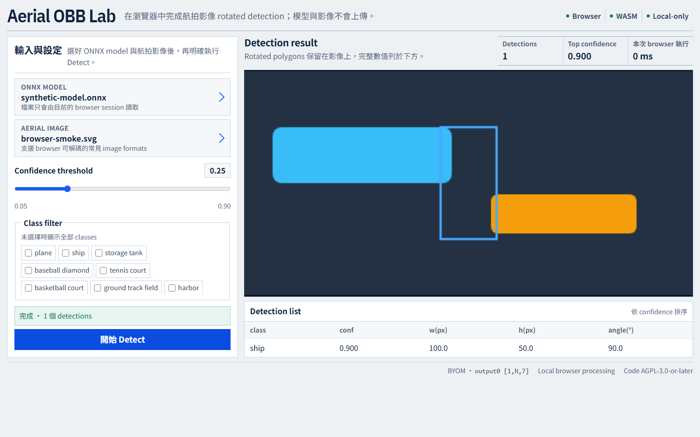
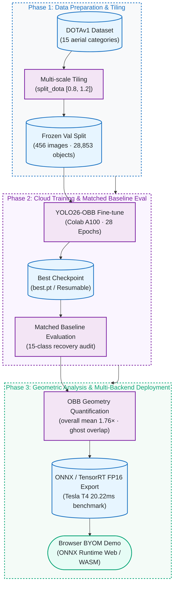

[正體中文](README.md) | English

# Aerial OBB Lab

[](https://github.com/kuotunyu/aerial-obb-lab/actions/workflows/release-gates.yml)


This project takes **YOLO26-OBB on DOTAv1** from A100 fine-tuning and matched baseline evaluation
through OBB/HBB geometry analysis, ONNX/TensorRT benchmarking, and a browser-native BYOM demo.
The result is reported as-is: matched fine-tuning was a near-tie/slight regression.

**Demo:** [`demo/web/`](demo/web/) · **Model card:** [`docs/model_card.md`](docs/model_card.md) ·
**Release scope:** code and evidence only; no weights.

<!-- claim:browser-scope -->
> The browser demo requires a compatible, user-supplied ONNX model and processes both the model
> and image locally. It does not represent the fine-tuned `yolo26m-obb` checkpoint's accuracy or
> its recorded T4 latency, and this repository does not distribute either model binary.
<!-- /claim:browser-scope -->

## Highlights

| Area | Result | Evidence boundary |
|---|---|---|
| Matched evaluation | Fine-tuned vs. official baseline: Δ mAP50 **-0.05pt**, Δ mAP50-95 **-0.13pt** | Near-tie/slight regression, not an accuracy gain |
| OBB geometry | 456 val images, 28,853 objects; overall weighted mean **1.76×**, bridge mean **2.43×** | Ground-truth geometry, not a detector benchmark |
| Deployment | TensorRT FP16 **20.22 ms / 49.4 FPS** | Historical Tesla T4, batch=1, 1024px environment |
| Browser-native demo | ONNX Runtime Web WASM and BYOM; model/image files stay local | Runtime code loads from jsDelivr with SRI; no bundled model, medium-checkpoint accuracy, or T4-latency claim |



*Synthetic UI fixture: a fixed SVG and stubbed `[1,N,7]` output verify UI/UX, decoding, and rendering without model inference.*

---

## Project Flow



Detailed training, evaluation, analysis, and deployment branches are documented below.

---

## Status

| Phase | Milestone | Execution Target | Status |
|---|---|---|---|
| Phase 0 | Scaffold, dependencies, and environment pinning | Local CPU | Complete |
| Phase 1 | DOTA8 smoke test (train→val→predict→resume→ONNX) | Workstation | Complete |
| Phase 2 | Full fine-tune on DOTAv1 (28 Epochs Early-stop) | Colab A100 | Complete |
| Phase 3 | Evaluation vs. official baseline & 15-class recovery | Colab + Local | Complete |
| Phase 4 | "Why OBB" quantitative geometry & ghost overlap analysis | Local | Complete |
| Phase 5 | ONNX / TensorRT export + 3-backend benchmark | Colab Tesla T4 | Complete |
| Phase 6 | Static browser-native BYOM demo | Local / Web | Complete |
| Phase 7 | Comprehensive technical docs, model card, release gates | Local CI | Complete |

---

## Evaluation: Fine-tuned vs. Official Baseline

<!-- claim:matched-evaluation -->
- **Training:** Colab A100; re-split DOTAv1 (`split_dota` `[0.8, 1.2]`); `yolo26m-obb.pt`
  ran 28/30 epochs and early-stopped at `patience=15`.
- **Recovery:** On 2026-07-15, a checksum/provenance-gated validation-only run restored `plane`
  0.952147/0.862352, `ship` 0.909448/0.762681, and `storage tank` 0.850699/0.716696
  (mAP50/mAP50-95).
- **Evidence:** [CSV](docs/per_class_metrics.csv) · [JSON](docs/per_class_metrics.json) ·
  [recovery notebook](notebooks/03_recover_per_class_metrics_colab.ipynb) ·
  [full analysis](docs/training_results.md).

| Model Variant | Evaluation Split | mAP50 | mAP50-95 |
|---|---|---:|---:|
| yolo26m-obb.pt (official, published) | DOTAv1 test | 81.0 | 55.3 |
| yolo26m-obb.pt (official, our reproduction) | DOTAv1 val (ours) | 78.2 | 63.3 |
| fine-tuned `best.pt` | DOTAv1 val (ours) | 78.2 | 63.1 |

**Comparison rule:** Only the bottom two rows are directly comparable: same val split, tiling,
and evaluation. The official test row is context only.

**Conclusion:** Fine-tuning is a **near-tie/slight regression** (Δ mAP50 **-0.05pt**,
Δ mAP50-95 **-0.13pt**), not an accuracy gain. The official checkpoint was already trained on
DOTAv1; this measures the marginal value of continuing an already-converged model.

**Limitation:** The baseline raw console log is not committed; four-decimal values and rounded
deltas are preserved historical results. Evidence strength and limits are machine-readable in
[`release/evidence.json`](release/evidence.json).
<!-- /claim:matched-evaluation -->

---

## Why Oriented Bounding Boxes? (quantified, not hand-waved)

<!-- claim:analysis -->
Measured on **28,853 ground-truth objects across 456 DOTAv1 val images**. The overall weighted mean
HBB/OBB area ratio is **1.76×**; the `bridge` mean is **2.43×**.
[Full tables](docs/analysis_results.md) · [Reproduction script](scripts/obb_analysis.py)

**1. Horizontal boxes swallow background.** Area of the axis-aligned box ÷ area of
the true oriented box:

| Object Class | Mean Area Inflation | p90 Inflation | | Control Class (Circular) | Mean Area Inflation |
|---|---:|---:|---|---|---:|
| bridge | 2.43× | 3.71× | | roundabout | 1.02× |
| harbor | 2.15× | 3.66× | | storage tank | 1.00× |
| large vehicle | 2.14× | 3.21× | | | |
| ship | 1.95× | 2.69× | | | |

**Reading:** Elongated, rotated objects inflate by about 2×; circular controls stay near 1.0×.

**2. In dense scenes, horizontal box overlap is mostly "ghost overlap".** Among adjacent
same-class objects with horizontal box IoU ≥ 0.3, the fraction where true oriented box IoU < 0.1:

| Object Class | Pairs with HBB IoU≥0.3 | Ghost Overlap Rate |
|---|---:|---:|
| large vehicle | 810 | 100% |
| ship | 736 | 99% |
| harbor | 43 | 98% |
| small vehicle | 42 | 93% |

**Limit:** This is a ground-truth geometry proxy, not a detector/NMS experiment. It identifies
potential HBB overlap and suppression risk, not actual prediction loss for a specific detector.

**3. Visual source:** Five DOTA-derived comparison crops are excluded from this code-only release;
only reproducible aggregate data remains.
<!-- /claim:analysis -->

---

## Deployment Benchmark: PyTorch vs. ONNX Runtime vs. TensorRT FP16

<!-- claim:t4-benchmark -->
- **Hardware:** Colab Tesla T4.
- **Input:** batch=1, imgsz=1024.
- **Measurement:** 20 warmups + 100 timed runs per backend.
- **Artifact:** fine-tuned `best.pt` → ONNX/TensorRT FP16; engine bound to its build GPU/TensorRT.
- **Notebook:** [02_benchmark_colab.ipynb](notebooks/02_benchmark_colab.ipynb).

<!-- claim:export-smoke -->
**Export smoke:** On DOTA8 val, PyTorch, ONNX, and TensorRT each reached mAP50 **0.9950** and met
the <1pt parity gate. This checks export consistency, **not full DOTAv1 production certification**;
raw logs are not committed.
<!-- /claim:export-smoke -->

| Inference Backend | File Size (MB) | Mean Latency | Median (p50) | 95th Percentile (p95) | Throughput (FPS) |
|---|---:|---:|---:|---:|---:|
| PyTorch (FP32) | 48.7 | 71.54 ms | 71.49 ms | 74.08 ms | 14.0 |
| ONNX Runtime GPU | 85.3 | 79.09 ms | 79.67 ms | 81.43 ms | 12.6 |
| TensorRT FP16 | 45.0 | 20.22 ms | 20.14 ms | 21.09 ms | 49.4 |

**Result:** Within this comparison, TensorRT FP16 is ~3.5× faster with the smallest file; ONNX Runtime
GPU is slightly slower than PyTorch. ONNX remains the interchange format for `demo/web/` and ONNX
Runtime **Web**.

**Evidence boundary:** These are historical results for the specified T4, batch=1, 1024px, and that
Colab/TensorRT environment. Exact runtime version strings were not preserved; the numbers do not
promise browser, other-hardware, throughput, or production-SLA performance.

**Environment notes:** `torch._dynamo`, HF CDN, and ONNX Runtime CUDA-provider issues are documented
in [docs/DESIGN_NOTES.md](docs/DESIGN_NOTES.md).
<!-- /claim:t4-benchmark -->

---

## Reproduction Steps

### 1. Local Development (CPU-only, no training or model inference required)

Requirements: Python 3.11 and CPU. Do not copy `.venv` across machines.

```powershell
uv python install 3.11
uv venv --python 3.11
uv sync --frozen --no-install-project
.venv/Scripts/python.exe scripts/repo_check.py
.venv/Scripts/python.exe scripts/release_check.py
.venv/Scripts/python.exe -m pytest
.venv/Scripts/python.exe -m http.server 8765 --directory demo/web
```

- Demo: open `http://localhost:8765`; model and image stay in the local browser.
- Default env: no Torch, CUDA, Ultralytics, or Python ONNX Runtime.
- Broken `.venv`: run `uv venv --clear --python 3.11`; use `.venv/bin/python` on Linux/macOS.
- Windows non-ASCII path: keep `--no-install-project` and call Python directly; see
  [DESIGN_NOTES T6](docs/DESIGN_NOTES.md).
- `tool.uv.link-mode = "copy"`: avoids environment/cache contamination.

The clean-export gate rebuilds a clean HEAD, checks tests/links/privacy/artifacts/browser, then
builds and installs the wheel. Browser smoke uses synthetic fixtures and performs no inference:

```powershell
.venv/Scripts/playwright.exe install chromium
.venv/Scripts/python.exe scripts/clean_export_check.py
```

### 2. Historical Colab Workflows (not part of this release gate)

These notebooks preserve provenance; **publishing, reviewing, or presenting this RC does not require
running them**. The first two use GPUs, DOTA, and authenticated private Hugging Face writes. Run them
only for an intentional reproduction after permission checks and a cell-by-cell review. Results are
frozen and must not be rerun merely to improve the numbers.

- [01_train_dotav1_a100.ipynb](notebooks/01_train_dotav1_a100.ipynb): original A100 fine-tuning,
  private checkpoint backup, and resume workflow.
- [02_benchmark_colab.ipynb](notebooks/02_benchmark_colab.ipynb): original T4 ONNX/TensorRT FP16
  export, parity, and three-backend benchmark workflow.
- [03_recover_per_class_metrics_colab.ipynb](notebooks/03_recover_per_class_metrics_colab.ipynb):
  validation-only recovery of three class rows from an owner-supplied, checksummed checkpoint; it
  does not download a model or retrain.

**Accepted evidence:** [evidence.json](release/evidence.json) ·
[per_class_metrics.json](docs/per_class_metrics.json) · [training results](docs/training_results.md) ·
[owner actions](docs/OWNER_ACTIONS.md)

### 3. Browser BYOM Demo

- Serve `demo/web/`, then choose a local ONNX model and image; both stay in the browser.
- The page requests only the pinned ONNX Runtime Web code from jsDelivr and verifies it with SHA-384
  SRI; it does not upload the model or image.
- Vanilla JavaScript + [ONNX Runtime Web](https://onnxruntime.ai/docs/tutorials/web/) (WASM);
  no named-model download, export, or fallback.
- Synthetic fixtures cross-check letterboxing, RGB CHW, `[N,7]` decode, angles, and rotated corners;
  no DOTA download or inference.

---

## Citation and License

- Repository code: **AGPL-3.0-or-later** as declared in `pyproject.toml`; Ultralytics components
  remain subject to their respective AGPL / Enterprise licensing.
- This code-only candidate does not contain DOTA images, annotations, derived renders, training
  weights, or exported models. DOTA remains restricted to non-commercial academic use; user-supplied
  models remain subject to their upstream dataset, software, and weight licenses, and this project
  makes no claim of commercial rights.
- Artifact hashes, third-party notices, and owner actions: see [artifact manifest](release/artifact-manifest.json),
  [third-party notices](THIRD_PARTY_NOTICES.md), [owner actions](docs/OWNER_ACTIONS.md), and
  [release checklist](RELEASE_CHECKLIST.md).
