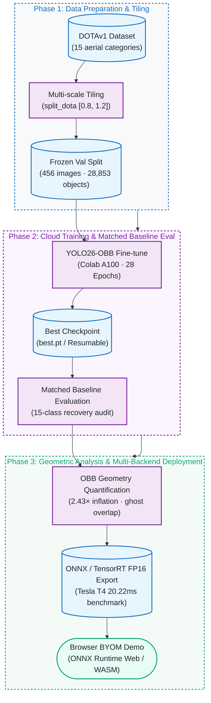

[正體中文](README.md) | English

# Aerial OBB Lab

[](https://github.com/kuotunyu/aerial-obb-lab/actions/workflows/ci.yml)


Fine-tuning **YOLO26-OBB** (oriented bounding boxes) on the **DOTAv1** aerial dataset, with a full lifecycle:
train on Colab A100 → evaluate against the official baseline → quantify OBB-vs-HBB annotation
geometry on aerial imagery → export ONNX / TensorRT FP16 with a 3-framework latency benchmark →
code-only Gradio and browser BYOM demos.

**Browser demo source:** [`demo/space-static/`](demo/space-static/) · **Model card:**
[`docs/model_card.md`](docs/model_card.md). This release ships code and evidence, not weights.

<!-- claim:browser-scope -->
> The browser demo requires a compatible, user-supplied ONNX model and processes both the model
> and image locally. It does not represent the fine-tuned `yolo26m-obb` checkpoint's accuracy or
> its recorded T4 latency, and this repository does not distribute either model binary.
<!-- /claim:browser-scope -->

---

## Project Flow



Detailed training, evaluation, analysis, and deployment branches are documented below.

---

## Status

| Phase | Milestone | Execution Target | Status |
|---|---|---|---|
| Phase 0 | Scaffold, dependencies, and environment pinning | Local CPU | Complete |
| Phase 1 | DOTA8 smoke test (train→val→predict→resume→HF push→ONNX) | Workstation | Complete |
| Phase 2 | Full fine-tune on DOTAv1 (28 Epochs Early-stop) | Colab A100 | Complete |
| Phase 3 | Evaluation vs. official baseline & 15-class recovery | Colab + Local | Complete |
| Phase 4 | "Why OBB" quantitative geometry & ghost overlap analysis | Local | Complete |
| Phase 5 | ONNX / TensorRT export + 3-backend benchmark | Colab Tesla T4 | Complete |
| Phase 6 | Local Gradio reference + static browser BYOM demo | Local / Web | Complete |
| Phase 7 | Comprehensive technical docs, model card, release gates | Local CI | Complete |

---

## Evaluation: Fine-tuned vs. Official Baseline

<!-- claim:matched-evaluation -->
Fine-tuned `yolo26m-obb.pt` on a re-split DOTAv1 (Colab A100, `split_dota` rates `[0.8, 1.2]`,
28/30 epochs, early-stopped on `patience=15`). A checksum- and provenance-gated validation-only
run completed on 2026-07-15 and restored the three per-class rows that the original session had
not preserved: `plane` 0.952147 / 0.862352, `ship` 0.909448 / 0.762681, and `storage tank`
0.850699 / 0.716696 (mAP50 / mAP50-95). The complete 15-class result is available as
[CSV](docs/per_class_metrics.csv) and [JSON](docs/per_class_metrics.json); the reproducibility
notebook is [notebooks/03_recover_per_class_metrics_colab.ipynb](notebooks/03_recover_per_class_metrics_colab.ipynb).
The comparison, recovery review, training-curve analysis, and confusion-matrix findings are in
[docs/training_results.md](docs/training_results.md).

| Model Variant | Evaluation Split | mAP50 | mAP50-95 |
|---|---|---:|---:|
| yolo26m-obb.pt (official, published) | DOTAv1 test | 81.0 | 55.3 |
| yolo26m-obb.pt (official, our reproduction) | DOTAv1 val (ours) | 78.2 | 63.3 |
| fine-tuned `best.pt` | DOTAv1 val (ours) | 78.2 | 63.1 |

Only the bottom two rows are directly comparable — same val split, same tiling, same eval
conditions. The top row uses DOTA's own test-split evaluation pipeline and is shown for
context, not comparison (see [docs/training_results.md](docs/training_results.md) for why the
test/val gap runs in an unexpected direction on mAP50 vs mAP50-95).

Under matched conditions, fine-tuning is a **near-tie/slight regression** (Δ mAP50
-0.05pt, Δ mAP50-95 -0.13pt). `yolo26m-obb.pt` is already the
official DOTAv1-trained checkpoint, so this quantifies the ceiling of continuing to fine-tune
an already-converged model on a re-tiled version of the same dataset, rather than demonstrating
a lift. The baseline's raw console log is not committed; its four-decimal values and these rounded
deltas are preserved accepted historical results. The checksum-gated fine-tuned aggregate and
limitations are machine-readable in [`release/evidence.json`](release/evidence.json).
<!-- /claim:matched-evaluation -->

---

## Why Oriented Bounding Boxes? (quantified, not hand-waved)

<!-- claim:analysis -->
Measured on **28,853 ground-truth objects across 456 DOTAv1 val images** (see
[docs/analysis_results.md](docs/analysis_results.md) for full tables,
[scripts/obb_analysis.py](scripts/obb_analysis.py) to reproduce):

**1. Horizontal boxes swallow background.** Area of the axis-aligned box ÷ area of
the true oriented box:

| Object Class | Mean Area Inflation | p90 Inflation | | Control Class (Circular) | Mean Area Inflation |
|---|---:|---:|---|---|---:|
| bridge | 2.43× | 3.71× | | roundabout | 1.02× |
| harbor | 2.15× | 3.66× | | storage tank | 1.00× |
| large vehicle | 2.14× | 3.21× | | | |
| ship | 1.95× | 2.69× | | | |

Elongated, arbitrarily-rotated objects force an HBB to be ~2× too large — while the
circular control classes (storage tank, roundabout) sit at 1.0×, confirming the
measurement isolates orientation, not labeling noise.

**2. In dense scenes, horizontal box overlap is mostly "ghost overlap".** Among adjacent
same-class objects with horizontal box IoU ≥ 0.3, the fraction where true oriented box IoU < 0.1:

| Object Class | Pairs with HBB IoU≥0.3 | Ghost Overlap Rate |
|---|---:|---:|
| large vehicle | 810 | 100% |
| ship | 736 | 99% |
| harbor | 43 | 98% |
| small vehicle | 42 | 93% |

This is a ground-truth geometry proxy, not a detector/NMS experiment. It shows HBB heavily
overestimates overlap among dense, oriented same-class objects, creating suppression risk;
it does not measure how many predictions a specific HBB detector actually loses.

**3. Visual comparison source:** Five original HBB-vs-OBB comparison crops were derived from
DOTA imagery and are excluded from this code-only release. The aggregate geometric data above
is preserved as reproducible, machine-readable evidence.
<!-- /claim:analysis -->

---

## Deployment Benchmark: PyTorch vs. ONNX Runtime vs. TensorRT FP16

<!-- claim:t4-benchmark -->
On Colab **Tesla T4**, exported fine-tuned `best.pt` to ONNX and TensorRT FP16 engine
([notebooks/02_benchmark_colab.ipynb](notebooks/02_benchmark_colab.ipynb), independently reproducible).
Export and benchmark were performed on Colab, not tied to contributor GPU or Windows TensorRT setup.
Batch=1, imgsz=1024, 20 warmup + 100 timed runs per backend; engines are bound to the GPU model
and TensorRT version used during build.

<!-- claim:export-smoke -->
**Export smoke check first** (DOTA8 val, matched conditions across all 3 backends):
PyTorch mAP50=0.9950, ONNX 0.9950, TensorRT 0.9950. All three match to reported precision
and meet the <1pt parity gate; this is an export smoke check, **not full DOTAv1 production certification**,
and raw console logs are not committed.
<!-- /claim:export-smoke -->

| Inference Backend | File Size (MB) | Mean Latency | Median (p50) | 95th Percentile (p95) | Throughput (FPS) |
|---|---:|---:|---:|---:|---:|
| PyTorch (FP32) | 48.7 | 71.54 ms | 71.49 ms | 74.08 ms | 14.0 |
| ONNX Runtime GPU | 85.3 | 79.09 ms | 79.67 ms | 81.43 ms | 12.6 |
| TensorRT FP16 | 45.0 | 20.22 ms | 20.14 ms | 21.09 ms | 49.4 |

These are historical measurements for the specified Tesla T4, batch=1, 1024px, 20+100 iterations,
and Colab/TensorRT environment; exact Torch, CUDA, ONNX Runtime, and TensorRT build strings
are not stored in committed raw logs. Within this matched comparison, TensorRT FP16 is ~3.5×
faster than native PyTorch with the smallest file size, but this is not a promise for browser
runtimes, other hardware, throughput scaling, or production SLAs. **ONNX Runtime GPU was slightly
slower than native PyTorch** — without a graph compiler like TensorRT, ONNX Runtime GPU execution
does not necessarily outperform PyTorch's own cuDNN kernels. It is retained because ONNX export
is the common starting point for both deployment paths (`demo/space/` server-side ONNX Runtime CPU
and `demo/space-static/` browser-side ONNX Runtime **Web**), not because GPU ONNX Runtime is the fastest.

Getting these numbers required working around several Colab environment hurdles:
`torch._dynamo` internal version mismatches, HF CDN link expiration during download, and an
ONNX Runtime CUDA execution provider crash that took down the entire Colab runtime (resolved by
running inference in an isolated subprocess). Full details in [docs/DESIGN_NOTES.md](docs/DESIGN_NOTES.md).
<!-- /claim:t4-benchmark -->

---

## Reproduction Steps

### 1. Local Development (CPU-only, no training or model inference required)

Pinned to Python 3.11 via `.python-version`. Virtual environments belong to the machine where
they were created; do not copy `.venv` across machines.

```powershell
uv python install 3.11
uv venv --python 3.11
uv sync --frozen --no-install-project
.venv/Scripts/python.exe scripts/repo_check.py
.venv/Scripts/python.exe scripts/release_check.py
.venv/Scripts/python.exe -m pytest
.venv/Scripts/python.exe -m http.server 8765 --directory demo/space-static
```

Open `http://localhost:8765` for the pure browser demo. The default environment installs analysis
and development tools only — it intentionally omits Torch, CUDA, Ultralytics, ONNX Runtime,
and Gradio; `tool.uv.link-mode = "copy"` prevents environment/cache cross-contamination.
If `.venv` was copied or created with the wrong interpreter, run `uv venv --clear --python 3.11`
first. On Linux/macOS, replace `.venv/Scripts/python.exe` with `.venv/bin/python`.

`--no-install-project` avoids creating an editable `.pth` pointer, which can cause CPython startup
failures on Windows when checkout paths contain non-ASCII characters (see [docs/DESIGN_NOTES.md](docs/DESIGN_NOTES.md) T6).
For the same reason, invoke `.venv/Scripts/python.exe` directly rather than using `uv run`.

On a clean committed HEAD, the release archive gate rebuilds the locked environment in a fresh
temporary directory, reruns tests, links, privacy, artifact, and browser checks, builds wheel/sdist,
and installs the wheel into a separate clean environment. The browser check uses synthetic fixtures
and stubbed outputs without executing model inference:

```powershell
.venv/Scripts/playwright.exe install chromium
.venv/Scripts/python.exe scripts/clean_export_check.py
```

### 2. Optional: Local ML / Gradio

```powershell
uv sync --frozen --no-install-project --group demo
$env:MODEL_PATH = "C:/models/your-model.onnx"
$env:MODEL_DEVICE = "cpu"
.venv/Scripts/python.exe demo/app.py
```

This group is provided for local presentation convenience and uses a CPU-only PyTorch wheel.
GPU training, full evaluation, export, and benchmarking are historical Colab workflows;
this release does not require rerunning them. Default checks and the static demo do not
require tokens or remote models.

### 3. Colab Workflow (Training + Recovery + Benchmark)

All three notebooks are self-contained and do not require cloning this repository:
1. Upload [notebooks/01_train_dotav1_a100.ipynb](notebooks/01_train_dotav1_a100.ipynb) → Runtime
   → A100 GPU → Add `HF_TOKEN` (write permission) under 🔑 Secrets → Run All. Downloads DOTAv1,
   tiles images, fine-tunes, and continuously pushes checkpoints to your HF model repo
   (automatically resumes if disconnected).
2. Upload [notebooks/02_benchmark_colab.ipynb](notebooks/02_benchmark_colab.ipynb) → T4 GPU
   → same `HF_TOKEN` secret → Run All. Exports ONNX + TensorRT FP16, validates export accuracy,
   and benchmarks the three backends.
3. To reproduce and verify the three recovered class metrics without retraining: upload
   [notebooks/03_recover_per_class_metrics_colab.ipynb](notebooks/03_recover_per_class_metrics_colab.ipynb)
   → Colab GPU (A100 recommended), place the checksummed checkpoint at `/content/best.pt`,
   and Run All. Does not download models; checks SHA-256 against the DOTAv1 ZIP and checkpoint,
   re-tiles, and records the validation manifest. Owners can pull this file from the uncommitted
   local path `runs/yolo26m-obb-dotav1/weights/best.pt`. Exports full 15-class CSV/JSON and validates
   against historical aggregates and the 12 previously-preserved rows. Approved results are recorded in
   [docs/training_results.md](docs/training_results.md); no rerun needed unless independently
   reproducing evidence.
4. Copy and record the `=== PASTE BACK ===` block printed at the end of each notebook.

### 4. Browser BYOM Demo

Serve `demo/space-static/` with any static HTTP server, then load a compatible local ONNX model
and image; both remain in the browser. `demo/space/` is an optional Gradio / CPU reference
implementation that likewise requires a local `MODEL_PATH`. Neither version downloads, exports,
or falls back to named models. The static version uses vanilla JavaScript +
[ONNX Runtime Web](https://onnxruntime.ai/docs/tutorials/web/) (WASM); committed synthetic fixtures
cross-check letterboxing, RGB CHW transposition, `[N,7]` decoding, angles, and rotated corners
against an independent CPU Python reference without downloading DOTA or running models.

---

## Citation and License

- Repository code: **AGPL-3.0-or-later** as declared in `pyproject.toml`; Ultralytics components
  remain subject to their respective AGPL / Enterprise licensing.
- This code-only candidate does not contain DOTA images, annotations, derived renders, training
  weights, or exported models. DOTA remains restricted to non-commercial academic use; user-supplied
  models remain subject to their upstream dataset, software, and weight licenses, and this project
  makes no claim of commercial rights.
- Artifact hashes, third-party notices, and owner actions: see [artifact manifest](release/artifact-manifest.json),
  [third-party notices](THIRD_PARTY_NOTICES.md), [owner actions](docs/OWNER_ACTIONS.md), and
  [release checklist](RELEASE_CHECKLIST.md).
