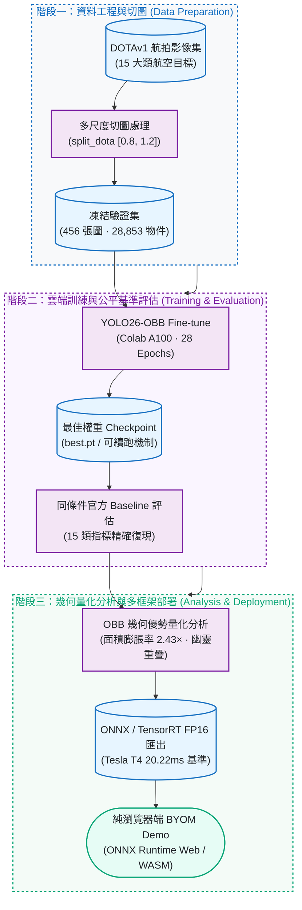

正體中文 | [English](README.en.md)

# Aerial OBB Lab

[](https://github.com/kuotunyu/aerial-obb-lab/actions/workflows/ci.yml)


以 **YOLO26-OBB**（旋轉目標檢測）在 **DOTAv1** 航拍資料集上進行 Fine-tuning，展示完整端到端工程生命週期：Colab A100 雲端訓練 → 與官方 Baseline 同條件對照評估 → 量化航拍標註中 OBB 與 HBB 幾何差異 → ONNX / TensorRT FP16 匯出與三框架 Latency Benchmark → 純前端靜態瀏覽器 BYOM Demo。

**瀏覽器 demo 原始碼：**[`demo/space-static/`](demo/space-static/) · **Model card：**[`docs/model_card.md`](docs/model_card.md)。本 release 只發布程式碼與證據，不發布權重。

<!-- claim:browser-scope -->
> 瀏覽器 demo 需要使用者自行提供相容的 ONNX 模型，模型與圖片都只在本機瀏覽器處理。
> 它不代表 fine-tuned `yolo26m-obb` checkpoint 的準確度或 T4 latency；本 repo 也不發布
> 這兩種模型檔。
<!-- /claim:browser-scope -->

---

## 專案流程



更細的訓練、評估、分析與部署分支收錄在下方各節。

---

## 執行進度

| 階段 (Phase) | 實作內容 | 執行環境 | 交付狀態 |
|---|---|---|---|
| Phase 0 | 專案骨架、依賴鎖定與開發環境設置 | 本機 CPU | 已完成 |
| Phase 1 | DOTA8 Smoke Test（Train ➔ Val ➔ Predict ➔ Resume ➔ ONNX） | 原開發電腦 | 已完成 |
| Phase 2 | DOTAv1 正式 Fine-tuning（28 Epochs Early-stop） | Google Colab A100 | 已完成 |
| Phase 3 | 同條件對照官方 Baseline 評估與 15 類指標復現 | Colab + 本機 | 已完成 |
| Phase 4 | 「為什麼需要 OBB」幾何膨脹率與幽靈重疊量化分析 | 本機 | 已完成 |
| Phase 5 | ONNX / TensorRT FP16 匯出與三框架 Latency Benchmark | Colab Tesla T4 | 已完成 |
| Phase 6 | 本機 Gradio 參考版 + 靜態 BYOM 純瀏覽器 Demo | 本機 / Web | 已完成 |
| Phase 7 | 完整技術文件、Model Card、發布稽核門禁 | 本機 CI | 已完成 |

---

## 評估：Fine-tuned vs 官方 Baseline

<!-- claim:matched-evaluation -->
在 Colab A100 上用重新切過的 DOTAv1（`split_dota` 尺度 `[0.8, 1.2]`）fine-tune
`yolo26m-obb.pt`，跑了 28/30 個 epoch、由 `patience=15` 觸發提早停止。2026-07-15 已完成有
checksum 與來源證據閘門的 validation-only 補值，補回原 session 未保存的三類：`plane`
0.952147 / 0.862352、`ship` 0.909448 / 0.762681、`storage tank` 0.850699 / 0.716696
（mAP50 / mAP50-95）。完整 15 類結果可查閱 [CSV](docs/per_class_metrics.csv) 與
[JSON](docs/per_class_metrics.json)，重現流程在
[notebooks/03_recover_per_class_metrics_colab.ipynb](notebooks/03_recover_per_class_metrics_colab.ipynb)。
逐類別對照、補值審核、訓練曲線分析與混淆矩陣發現見
[docs/training_results.md](docs/training_results.md)。

| 模型配置 | 評估資料劃分 (Split) | mAP50 | mAP50-95 |
|---|---|---:|---:|
| yolo26m-obb.pt（官方公布數字） | DOTAv1 test | 81.0 | 55.3 |
| yolo26m-obb.pt（官方權重，本專案實測） | DOTAv1 val（本專案切法） | 78.2 | 63.3 |
| fine-tuned `best.pt` | DOTAv1 val（本專案切法） | 78.2 | 63.1 |

**只有下面兩行可以直接比較**——同一個 val split、同樣的切圖方式、同一套驗證流程、同條件。
第一行是官方在 test split 上、用 DOTA 官方評測工具算出的數字，放在這裡僅供參考，不是拿來
比較用的（test/val 這個落差在 mAP50 跟 mAP50-95 上方向不一致，原因見
[docs/training_results.md](docs/training_results.md)）。

在同條件下比較，fine-tune 是**持平略降**（Δ mAP50 -0.05 個百分點、Δ mAP50-95 -0.13 個
百分點），不是精度提升：`yolo26m-obb.pt` 本來就是官方在 DOTAv1 上訓練過
的權重，這次等於是「繼續訓練一個已經收斂的模型」而不是「帶模型認識新領域」，這個結果量化
的正是在這種情境下的邊際效益上限。Baseline 原始 console log 未提交；四位小數與上述四捨五入
delta 是保留的正式歷史結果。Fine-tuned aggregate、證據強度與限制可由
[`release/evidence.json`](release/evidence.json) 機器驗證。
<!-- /claim:matched-evaluation -->

---

## 為什麼需要旋轉框？（用數據說話）

<!-- claim:analysis -->
在 **DOTAv1 驗證集 456 張圖、28,853 個標註物件**上實測（完整表格見
[docs/analysis_results.md](docs/analysis_results.md)，重現腳本
[scripts/obb_analysis.py](scripts/obb_analysis.py)）：

**1. 水平框吞掉大量背景。** 「軸對齊外接框面積 ÷ 旋轉框面積」：

| 目標類別 | 平均膨脹倍數 | p90 膨脹倍數 | | 對照組（圓形目標） | 平均膨脹倍數 |
|---|---:|---:|---|---|---:|
| bridge | 2.43× | 3.71× | | roundabout | 1.02× |
| harbor | 2.15× | 3.66× | | storage tank | 1.00× |
| large vehicle | 2.14× | 3.21× | | | |
| ship | 1.95× | 2.69× | | | |

細長且任意旋轉的目標會讓水平框膨脹約 2 倍；而圓形類別（儲油槽、圓環）維持 1.0×，
證明這個量測反映的是「方向性」而非標註雜訊。

**2. 密集場景中，水平框的重疊多半是「幽靈重疊」。** 同類別相鄰物件中，
水平框 IoU ≥ 0.3 的配對裡，實際旋轉框 IoU < 0.1 的比例：

| 目標類別 | HBB IoU≥0.3 配對數 | 幽靈重疊率 |
|---|---:|---:|
| large vehicle | 810 | 100% |
| ship | 736 | 99% |
| harbor | 43 | 98% |
| small vehicle | 42 | 93% |

這是 ground-truth 幾何 proxy，不是 detector/NMS 實驗。結果顯示 HBB 會大幅高估密集同類物件
的重疊，因而形成 suppression 風險；它沒有量測特定 HBB detector 實際少掉多少 predictions。

**3. 視覺比較來源：**原有五張 HBB 與 OBB 比較圖衍生自 DOTA 影像，因此刻意不納入
這份公開的 code-only release。上方彙總幾何數據仍以可重現、機器可讀的證據保留。
<!-- /claim:analysis -->

---

## 部署 Benchmark：PyTorch vs ONNX Runtime vs TensorRT FP16

<!-- claim:t4-benchmark -->
在 Colab **Tesla T4** 上把 fine-tuned `best.pt` 匯出成 ONNX 跟 TensorRT FP16 engine
（[notebooks/02_benchmark_colab.ipynb](notebooks/02_benchmark_colab.ipynb)，可獨立重現）。匯出
與 benchmark 固定在 Colab 執行，不綁定貢獻者自己的 GPU 或 Windows TensorRT 環境。batch=1、imgsz=1024，每個後端
20 次 warmup + 100 次計時取平均，engine 綁定這次 build 用的 GPU 型號與 TensorRT 版本。

<!-- claim:export-smoke -->
**先做匯出 smoke**（DOTA8 val，同工具同條件比較三個後端）：PyTorch mAP50=0.9950、
ONNX 0.9950、TensorRT 0.9950。三者在報告的四位小數相同並符合 <1 個百分點 parity 門檻；
這只是 export smoke，**不是完整 DOTAv1 production certification**，且原始 console log 未提交。
<!-- /claim:export-smoke -->

| 推論後端 (Backend) | 檔案大小 (MB) | 平均延遲 (Mean Latency) | 延遲中位數 (p50) | 95 分位延遲 (p95) | 輸送量 (FPS) |
|---|---:|---:|---:|---:|---:|
| PyTorch (FP32) | 48.7 | 71.54 ms | 71.49 ms | 74.08 ms | 14.0 |
| ONNX Runtime GPU | 85.3 | 79.09 ms | 79.67 ms | 81.43 ms | 12.6 |
| TensorRT FP16 | 45.0 | 20.22 ms | 20.14 ms | 21.09 ms | 49.4 |

這是指定 Tesla T4、batch=1、1024px、20+100 次量測與當時 Colab/TensorRT 環境的正式**歷史**
結果；該次 Torch、CUDA、ONNX Runtime、TensorRT 的完整版本字串未保存在 committed raw log。
在這個限定比較內，TensorRT FP16 比原生 PyTorch 快約 3.5 倍且檔案最小，但不是瀏覽器、其他
硬體、throughput 或 production SLA 的承諾。**ONNX Runtime GPU 反而比原生
PyTorch 略慢**——沒有 TensorRT 這種圖編譯後端加持的話，ONNX Runtime 的 GPU 執行不一定會贏
PyTorch 自己的 cuDNN kernel。會保留這個後端是因為 ONNX 匯出是下面兩種部署路線共同的起點
（`demo/space/` 的伺服器端 ONNX Runtime CPU、以及 `demo/space-static/` 的瀏覽器端
ONNX Runtime **Web**）——不是因為 GPU 版 ONNX Runtime 本身是最快的選項。

拿到這組數字的過程踩了好幾輪 Colab 環境的坑，都不是這個專案自己程式碼的問題：`torch._dynamo`
內部版本兜不起來、HF 檔案 CDN 間歇性回傳簽章失效的下載連結、ONNX Runtime 的 CUDA 執行
provider 會讓整個 Colab 執行階段原生崩潰（後來改用獨立子行程隔離跑推論解決）。完整過程寫在
[docs/DESIGN_NOTES.md](docs/DESIGN_NOTES.md)。
<!-- /claim:t4-benchmark -->

---

## 重現步驟

### 1. 本機開發（CPU-only，不需訓練或模型推論）

專案以 `.python-version` 固定 Python 3.11。虛擬環境只屬於建立它的那台電腦，請勿從其他電腦
複製 `.venv`。

```powershell
uv python install 3.11
uv venv --python 3.11
uv sync --frozen --no-install-project
.venv/Scripts/python.exe scripts/repo_check.py
.venv/Scripts/python.exe scripts/release_check.py
.venv/Scripts/python.exe -m pytest
.venv/Scripts/python.exe -m http.server 8765 --directory demo/space-static
```

開啟 `http://localhost:8765` 即可使用純瀏覽器 demo。預設安裝只含分析與開發工具，刻意不安裝
Torch、CUDA、Ultralytics、ONNX Runtime 或 Gradio；`tool.uv.link-mode = "copy"` 也會避免環境
與 uv 套件快取彼此污染。
如果 `.venv` 是從其他電腦複製過來或用了錯誤直譯器，請先用
`uv venv --clear --python 3.11` 重建一次。Linux/macOS 請把上方 Windows 路徑改成
`.venv/bin/python`。

`--no-install-project` 會避開 editable-install 的 `.pth` 指標檔；Windows checkout 路徑含非 ASCII
字元時，該檔可能讓 CPython 啟動失敗（細節見 [docs/DESIGN_NOTES.md](docs/DESIGN_NOTES.md) T6）。
基於同一原因，請直接呼叫 `.venv/Scripts/python.exe`，不要用 `uv run`。

在乾淨、已提交的 HEAD 上，release archive gate 會於全新暫存目錄重建 locked 環境，
重跑 tests、links、privacy、artifact 與 browser 檢查，建置 wheel/sdist，並在另一個乾淨
環境安裝 wheel。Browser 步驟只使用 synthetic fixture 與固定 output stub，不會執行模型
inference：

```powershell
.venv/Scripts/playwright.exe install chromium
.venv/Scripts/python.exe scripts/clean_export_check.py
```

### 2. 選配：本機 ML／Gradio

```powershell
uv sync --frozen --no-install-project --group demo
$env:MODEL_PATH = "C:/models/your-model.onnx"
$env:MODEL_DEVICE = "cpu"
.venv/Scripts/python.exe demo/app.py
```

此群組只為方便本機展示，並刻意使用 CPU-only PyTorch wheel。GPU 訓練、完整評估、匯出與
benchmark 是歷史 Colab 工作流；本 release 不需要重跑。預設檢查與 static demo 都不需要
token 或網路模型。

### 3. Colab 雲端流程（訓練 + 評估補值 + Benchmark）

三份 notebook 都是自包含的，不需要 clone 這個 repo：
1. 上傳 [notebooks/01_train_dotav1_a100.ipynb](notebooks/01_train_dotav1_a100.ipynb) →
   執行階段 → A100 GPU → 左側 🔑 Secrets 加 `HF_TOKEN`（write 權限）→ 全部執行。會自動下載
   DOTAv1、切圖、fine-tune，訓練過程中持續把 checkpoint push 到你的 HF model repo（斷線也
   不怕，重新打開同一份 notebook 再執行會自動接續）
2. 上傳 [notebooks/02_benchmark_colab.ipynb](notebooks/02_benchmark_colab.ipynb) → T4 GPU
   → 同一個 `HF_TOKEN` secret → 全部執行。會匯出 ONNX + TensorRT FP16、驗證匯出精度、
   benchmark 三種後端
3. 若要免重訓重現並驗證已補回的三類指標，上傳
   [notebooks/03_recover_per_class_metrics_colab.ipynb](notebooks/03_recover_per_class_metrics_colab.ipynb)
   → Colab GPU（建議 A100），先把 owner 持有且 checksum 相符的 checkpoint 上傳成
   `/content/best.pt`，再全部執行。Notebook 不會下載模型；它會核對 checkpoint 與 DOTAv1 ZIP
   的 SHA-256，再依原參數重切並記錄 val manifest。Owner 可從未納入 Git 的本機
   `runs/yolo26m-obb-dotav1/weights/best.pt` 取得該檔。它會匯出完整 15 類 CSV/JSON，並用歷史 aggregate
   與原先保存的 12 類驗證補值。通過審核的結果已記錄在
   [docs/training_results.md](docs/training_results.md)；除非要獨立重現證據，否則不需要再跑一次
4. 把每份 notebook 最後印出的 `=== PASTE BACK ===` 區塊複製下來記錄

### 4. 瀏覽器 BYOM Demo

用任一 static HTTP server 提供 `demo/space-static/`，再選擇相容的本機
ONNX 檔與圖片；兩者都留在瀏覽器。`demo/space/` 是選配的 Gradio／CPU 參考實作，同樣強制指定
本機 `MODEL_PATH`。兩個版本都不會下載、export 或 fallback 到具名模型。Static 版本使用純
JavaScript + [ONNX Runtime Web](https://onnxruntime.ai/docs/tutorials/web/)（WASM）；committed
synthetic fixture 會在不下載 DOTA、不執行模型的條件下，把 letterbox、RGB CHW、`[N,7]` decode、
angle 與 rotated corners 和獨立 CPU Python reference 交叉比對。

---

## 授權與聲明

- Repository code：依 `pyproject.toml` 宣告為 **AGPL-3.0-or-later**；Ultralytics components
  仍受 Ultralytics 各自的 AGPL／Enterprise 授權路線約束。
- 這份 code-only candidate 不含 DOTA 圖像、標註、衍生 render、訓練權重或匯出模型。DOTA 仍限
  學術用途；使用者自行提供的模型仍受其資料集、上游軟體與權重條款約束，本專案不主張取得商用許可。
- Artifact hash、第三方條款與 owner actions：見 [artifact manifest](release/artifact-manifest.json)、
  [third-party notices](THIRD_PARTY_NOTICES.md)、[owner actions](docs/OWNER_ACTIONS.md) 與
  [release checklist](RELEASE_CHECKLIST.md)。

*English version: [README.en.md](README.en.md)*
