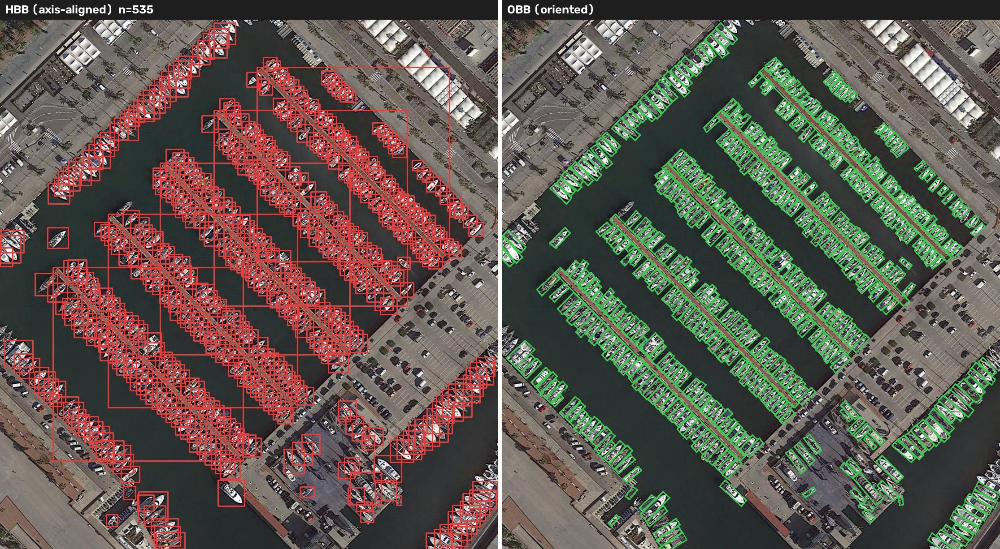

# YOLO26 OBB on DOTA: Aerial Oriented Object Detection, Training to Deployment

> ✅ Complete (Phase 0–7) — see [docs/PLAN.md](docs/PLAN.md) for the full project plan.

Fine-tuning **YOLO26-OBB** (oriented bounding boxes) on the **DOTAv1** aerial dataset, with a full lifecycle:
train on Colab A100 → evaluate against the official baseline → quantify *why OBB beats horizontal boxes* on aerial imagery → export ONNX / TensorRT FP16 with a 3-framework latency benchmark → Gradio demo + Hugging Face Space.

**🚀 Live demo (100% browser-side, no server): https://huggingface.co/spaces/steven0226/yolo26-obb-aerial-detection**
**Model card: https://huggingface.co/steven0226/yolo26m-obb-dota**

## Status

| Phase | What | Where | Status |
|---|---|---|---|
| 0 | Scaffold & environment | local | ✅ |
| 1 | DOTA8 smoke test (train→val→predict→resume→HF push→ONNX) | local (RTX 2070) | ✅ |
| 2 | Full fine-tune on DOTAv1 | Colab A100 | ✅ |
| 3 | Evaluation vs. official baseline | Colab + local | ✅ |
| 4 | "Why OBB" quantitative analysis | local | ✅ |
| 5 | ONNX / TensorRT export + benchmark | Colab GPU | ✅ |
| 6 | Gradio demo + HF Space (CPU) | local + HF | ✅ |
| 7 | Docs, model card, wrap-up | — | ✅ |

## Evaluation: Fine-tuned vs. Official Baseline

Fine-tuned `yolo26m-obb.pt` on a re-split DOTAv1 (Colab A100, `split_dota` rates `[0.8, 1.2]`,
28/30 epochs, early-stopped on `patience=15`). Full per-class breakdown, training-curve
analysis, and confusion-matrix findings in
[docs/training_results.md](docs/training_results.md).

| model | split | mAP50 | mAP50-95 |
|---|---|---:|---:|
| yolo26m-obb.pt (official, published) | DOTAv1 test | 81.0 | 55.3 |
| yolo26m-obb.pt (official, our reproduction) | DOTAv1 val (ours) | 78.2 | 63.3 |
| fine-tuned `best.pt` | DOTAv1 val (ours) | 78.2 | 63.1 |

Only the bottom two rows are directly comparable — same val split, same tiling, same eval
conditions. The top row uses DOTA's own test-split evaluation pipeline and is shown for
context, not comparison (see [docs/training_results.md](docs/training_results.md) for why the
test/val gap runs in an unexpected direction on mAP50 vs mAP50-95).

Under matched conditions, fine-tuning moved the needle by essentially nothing (Δ mAP50
-0.05pt, Δ mAP50-95 -0.13pt). That's expected, not a failure: `yolo26m-obb.pt` is already the
official DOTAv1-trained checkpoint, so this quantifies the ceiling of continuing to fine-tune
an already-converged model on a re-tiled version of the same dataset, rather than demonstrating
a big lift.

## Why Oriented Bounding Boxes? (quantified, not hand-waved)

Measured on **28,853 ground-truth objects across 456 DOTAv1 val images** (see
[docs/analysis_results.md](docs/analysis_results.md) for full tables,
[scripts/obb_analysis.py](scripts/obb_analysis.py) to reproduce):

**1. Horizontal boxes swallow background.** Area of the axis-aligned box ÷ area of
the true oriented box:

| class | mean | p90 | | class (control) | mean |
|---|---:|---:|---|---|---:|
| bridge | **2.43×** | 3.71× | | roundabout | 1.02× |
| harbor | **2.15×** | 3.66× | | storage tank | 1.00× |
| large vehicle | **2.14×** | 3.21× | | | |
| ship | **1.95×** | 2.69× | | | |

Elongated, arbitrarily-rotated objects force an HBB to be ~2× too large — while the
circular control classes (storage tank, roundabout) sit at 1.0×, confirming the
measurement isolates orientation, not labeling noise.

**2. In dense scenes, HBB overlap is mostly *phantom* overlap.** Among same-class
neighbor pairs whose *horizontal* boxes overlap heavily (IoU ≥ 0.3), the fraction whose
*oriented* boxes barely overlap at all (IoU < 0.1):

| class | HBB IoU≥0.3 pairs | phantom rate |
|---|---:|---:|
| large vehicle | 810 | **100%** |
| ship | 736 | **99%** |
| harbor | 43 | **98%** |
| small vehicle | 42 | **93%** |

A horizontal-box detector's NMS sees these as duplicate detections and suppresses true
positives — parked trucks and docked ships literally disappear. Oriented boxes make the
overlap (and the NMS decision) reflect reality.

**3. Seeing is believing** — same marina, same labels (all five comparisons in `assets/`):



## Deployment Benchmark: PyTorch vs. ONNX Runtime vs. TensorRT FP16

Exported the fine-tuned `best.pt` to ONNX and a TensorRT FP16 engine on a Colab **Tesla T4**
(`notebooks/02_benchmark_colab.ipynb`, reproducible standalone — original plan was to build the
TensorRT engine on a local RTX 4090; actual local hardware is an RTX 2070 8GB, so this moved to
Colab, which doubles as the workaround for TensorRT's rough Windows install story). Batch=1,
imgsz=1024, 20 warmup + 100 timed runs per backend, engine build tied to this exact GPU model
and TensorRT version.

**Export accuracy check first** (dota8 val, same tool/conditions across backends): PyTorch
mAP50=0.9950, ONNX 0.9950, TensorRT 0.9950 — no accuracy loss from either export, clears the
<1pt tolerance this project set going in given YOLO26's known end-to-end export issues
(ultralytics#23397 et al.).

| backend | size (MB) | mean latency | p50 | p95 | FPS |
|---|---:|---:|---:|---:|---:|
| PyTorch (FP32) | 48.7 | 71.54 ms | 71.49 ms | 74.08 ms | 14.0 |
| ONNX Runtime GPU | 85.3 | 79.09 ms | 79.67 ms | 81.43 ms | 12.6 |
| TensorRT FP16 | 45.0 | 20.22 ms | 20.14 ms | 21.09 ms | 49.4 |

**TensorRT FP16 is ~3.5× faster than eager PyTorch** and comes in at the smallest file size.
**ONNX Runtime GPU is actually slightly slower than native PyTorch here** — without a
graph-compilation backend like TensorRT behind it, ONNX Runtime's GPU execution provider doesn't
automatically beat PyTorch's own cuDNN kernels. It's included for completeness and because the
ONNX export is the common ancestor of both deployment paths below (server-side ONNX Runtime CPU
in `demo/space/`, and ONNX Runtime **Web** running client-side in the actually-deployed
`demo/space-static/`) — not because GPU ONNX Runtime itself is the fastest option here.

Getting these numbers took several rounds of environment debugging on Colab's side, none of it
this project's own code: a broken `torch._dynamo` build, HF's file CDN intermittently returning
signed URLs with an invalid key, and ONNX Runtime's CUDA execution provider crashing the whole
Colab runtime outright (worked around by running that inference in an isolated subprocess). Full
writeup in [docs/DESIGN_NOTES.md](docs/DESIGN_NOTES.md).

## Reproduction

**Local (Windows, RTX 2070–class GPU or better)**
```bash
uv sync                          # creates .venv, installs pinned deps (see pyproject.toml)
# put HF_TOKEN=hf_xxx in .env (write-scoped token; needed for HF pull/push)
.venv/Scripts/python.exe scripts/smoke_test.py     # DOTA8 train/val/predict/resume/HF-push/ONNX, all-green check
.venv/Scripts/python.exe scripts/obb_analysis.py   # regenerates docs/analysis_results.md + assets/
.venv/Scripts/python.exe demo/app.py               # local Gradio demo (falls back to official weights if no fine-tuned best.pt yet)
```
Don't use `uv run` on a path with non-ASCII characters — it rewrites an editable-install
pointer file that CPython's `site.py` can fail to decode, corrupting the whole venv until the
`.pth` file is removed (see [docs/DESIGN_NOTES.md](docs/DESIGN_NOTES.md) T6). Call
`.venv/Scripts/python.exe` directly instead.

**Colab (training + benchmark)** — both notebooks are self-contained, no repo clone needed:
1. Upload [notebooks/01_train_dotav1_a100.ipynb](notebooks/01_train_dotav1_a100.ipynb) →
   Runtime → A100 GPU → add `HF_TOKEN` (write scope) under 🔑 Secrets → Run all. Downloads
   DOTAv1, tiles it, fine-tunes, and pushes checkpoints to your HF model repo as it goes
   (survives disconnects — rerunning the same notebook auto-resumes).
2. Upload [notebooks/02_benchmark_colab.ipynb](notebooks/02_benchmark_colab.ipynb) → T4 GPU →
   same `HF_TOKEN` secret → Run all. Exports ONNX + TensorRT FP16, checks export parity, and
   benchmarks all three backends.
3. Copy each notebook's final `=== PASTE BACK ===` block to wherever you're tracking results.

**HF Space (live demo)**: push the contents of `demo/space-static/` to a new Space with the
**static** SDK (each folder's `README.md` is already the Space's config frontmatter). This is
what's actually deployed — see below for why. `demo/space/` (Gradio SDK, server-side ONNX
Runtime CPU) is kept in the repo as a working, locally-tested reference implementation, but was
never deployed as a Space.

**Why two implementations exist**: HF now requires a PRO subscription to host Gradio/Docker
Spaces even on the free `cpu-basic` tier (`Static Spaces are free for everyone, but hosting
Gradio and Docker Spaces on free cpu-basic requires a PRO subscription` — a real API response
hit while building this). Without PRO, the only route to a permanent, always-on, free public
demo is a **static** Space with inference running client-side. `demo/space-static/` reimplements
the same detection pipeline as vanilla JS + [ONNX Runtime Web](https://onnxruntime.ai/docs/tutorials/web/)
(WASM) — the model downloads once (~10MB) and every prediction runs entirely in the visitor's
browser, no server involved at all. I/O format (letterbox preprocessing, `[N,7]` output decoding)
was reverse-engineered and verified against the Python reference before writing a single line of
JS — see [docs/DESIGN_NOTES.md](docs/DESIGN_NOTES.md) for the full story.

## Licensing

- Code: **AGPL-3.0** (required by [Ultralytics](https://github.com/ultralytics/ultralytics) AGPL-3.0; fine-tuned weights are derivative and carry the same license)
- Dataset: **DOTA** is released for **academic use only — commercial use is prohibited**

*(中文版見 README.zh-TW.md)*
