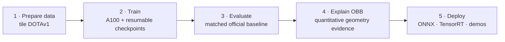

# YOLO26 OBB on DOTA: Aerial Oriented Object Detection, Training to Deployment

> ✅ Complete (Phase 0–7) — see [docs/PLAN.md](docs/PLAN.md) for the full project plan.

Fine-tuning **YOLO26-OBB** (oriented bounding boxes) on the **DOTAv1** aerial dataset, with a full lifecycle:
train on Colab A100 → evaluate against the official baseline → quantify OBB-vs-HBB annotation
geometry on aerial imagery → export ONNX / TensorRT FP16 with a 3-framework latency benchmark →
Gradio demo + Hugging Face Space.

**🚀 Live demo (100% browser-side, no server): https://huggingface.co/spaces/steven0226/yolo26-obb-aerial-detection**
**Model card: https://huggingface.co/steven0226/yolo26m-obb-dota**

<!-- claim:browser-scope -->
> The live Space deliberately uses the lightweight official `yolo26n-obb` ONNX model so it can
> run in a browser. It does not represent the fine-tuned `yolo26m-obb` checkpoint's accuracy or
> its recorded T4 latency; those artifacts are published in the model repository above and power
> the optional local demo.
<!-- /claim:browser-scope -->

## Project Flow



Detailed training, evaluation, analysis, and deployment branches are documented below.

## Status

| Phase | What | Where | Status |
|---|---|---|---|
| 0 | Scaffold & environment | local | ✅ |
| 1 | DOTA8 smoke test (train→val→predict→resume→HF push→ONNX) | original local workstation | ✅ |
| 2 | Full fine-tune on DOTAv1 | Colab A100 | ✅ |
| 3 | Evaluation vs. official baseline | Colab + local | ✅ |
| 4 | "Why OBB" quantitative analysis | local | ✅ |
| 5 | ONNX / TensorRT export + benchmark | Colab GPU | ✅ |
| 6 | Local Gradio reference + static browser HF Space | local + HF | ✅ |
| 7 | Docs, model card, wrap-up | — | ✅ |

## Evaluation: Fine-tuned vs. Official Baseline

<!-- claim:matched-evaluation -->
Fine-tuned `yolo26m-obb.pt` on a re-split DOTAv1 (Colab A100, `split_dota` rates `[0.8, 1.2]`,
28/30 epochs, early-stopped on `patience=15`). A checksum- and provenance-gated validation-only
run completed on 2026-07-15 and restored the three per-class rows that the original session had
not preserved: `plane` 0.952147 / 0.862352, `ship` 0.909448 / 0.762681, and `storage tank`
0.850699 / 0.716696 (mAP50 / mAP50-95). The complete 15-class result is available as
[CSV](docs/per_class_metrics.csv) and [JSON](docs/per_class_metrics.json); the reproducibility
notebook is [notebooks/03_recover_per_class_metrics_colab.ipynb](notebooks/03_recover_per_class_metrics_colab.ipynb).
The comparison, recovery review, training-curve analysis, and confusion-matrix findings are in
[docs/training_results.md](docs/training_results.md).

| model | split | mAP50 | mAP50-95 |
|---|---|---:|---:|
| yolo26m-obb.pt (official, published) | DOTAv1 test | 81.0 | 55.3 |
| yolo26m-obb.pt (official, our reproduction) | DOTAv1 val (ours) | 78.2 | 63.3 |
| fine-tuned `best.pt` | DOTAv1 val (ours) | 78.2 | 63.1 |

Only the bottom two rows are directly comparable — same val split, same tiling, same eval
conditions. The top row uses DOTA's own test-split evaluation pipeline and is shown for
context, not comparison (see [docs/training_results.md](docs/training_results.md) for why the
test/val gap runs in an unexpected direction on mAP50 vs mAP50-95).

Under matched conditions, fine-tuning is a **near-tie/slight regression** (Δ mAP50
-0.05pt, Δ mAP50-95 -0.13pt). `yolo26m-obb.pt` is already the
official DOTAv1-trained checkpoint, so this quantifies the ceiling of continuing to fine-tune
an already-converged model on a re-tiled version of the same dataset, rather than demonstrating
a lift. The baseline's raw console log is not committed; its four-decimal values and these rounded
deltas are preserved accepted historical results. The checksum-gated fine-tuned aggregate and
limitations are machine-readable in [`release/evidence.json`](release/evidence.json).
<!-- /claim:matched-evaluation -->

## Why Oriented Bounding Boxes? (quantified, not hand-waved)

<!-- claim:analysis -->
Measured on **28,853 ground-truth objects across 456 DOTAv1 val images** (see
[docs/analysis_results.md](docs/analysis_results.md) for full tables,
[scripts/obb_analysis.py](scripts/obb_analysis.py) to reproduce):

**1. Horizontal boxes swallow background.** Area of the axis-aligned box ÷ area of
the true oriented box:

| class | mean | p90 | | class (control) | mean |
|---|---:|---:|---|---|---:|
| bridge | **2.43×** | 3.71× | | roundabout | 1.02× |
| harbor | **2.15×** | 3.66× | | storage tank | 1.00× |
| large vehicle | **2.14×** | 3.21× | | | |
| ship | **1.95×** | 2.69× | | | |

Elongated, arbitrarily-rotated objects force an HBB to be ~2× too large — while the
circular control classes (storage tank, roundabout) sit at 1.0×, confirming the
measurement isolates orientation, not labeling noise.

**2. In dense scenes, HBB overlap is mostly *phantom* overlap.** Among same-class
neighbor pairs whose *horizontal* boxes overlap heavily (IoU ≥ 0.3), the fraction whose
*oriented* boxes barely overlap at all (IoU < 0.1):

| class | HBB IoU≥0.3 pairs | phantom rate |
|---|---:|---:|
| large vehicle | 810 | **100%** |
| ship | 736 | **99%** |
| harbor | 43 | **98%** |
| small vehicle | 42 | **93%** |

This ground-truth geometry result is a proxy, not a detector/NMS experiment. It shows that an
HBB view can substantially overstate overlap and therefore create suppression risk in dense
scenes; it does not measure how many predictions a particular HBB detector would lose.

**3. Seeing is believing** — same marina, same labels (all five comparisons in `assets/`):


<!-- /claim:analysis -->

## Deployment Benchmark: PyTorch vs. ONNX Runtime vs. TensorRT FP16

<!-- claim:t4-benchmark -->
Exported the fine-tuned `best.pt` to ONNX and a TensorRT FP16 engine on a Colab **Tesla T4**
(`notebooks/02_benchmark_colab.ipynb`, reproducible standalone). Export and benchmarking run in
Colab rather than depending on a contributor's local GPU or Windows TensorRT setup. Batch=1,
imgsz=1024, 20 warmup + 100 timed runs per backend, engine build tied to this exact GPU model
and TensorRT version.

<!-- claim:export-smoke -->
**Export smoke first** (DOTA8 val, same tool/conditions across backends): PyTorch mAP50=0.9950,
ONNX 0.9950, TensorRT 0.9950. These values are identical to four reported decimals and clear the
project's <1pt parity tolerance. This is an export smoke check, **not full DOTAv1 production certification**,
and the raw console log is not committed.
<!-- /claim:export-smoke -->

| backend | size (MB) | mean latency | p50 | p95 | FPS |
|---|---:|---:|---:|---:|---:|
| PyTorch (FP32) | 48.7 | 71.54 ms | 71.49 ms | 74.08 ms | 14.0 |
| ONNX Runtime GPU | 85.3 | 79.09 ms | 79.67 ms | 81.43 ms | 12.6 |
| TensorRT FP16 | 45.0 | 20.22 ms | 20.14 ms | 21.09 ms | 49.4 |

These are accepted **historical** results for that specific T4, batch=1, 1024px, 20+100-run
Colab/TensorRT environment. The exact Torch, CUDA, ONNX Runtime, and TensorRT version strings from
the run are not preserved in a committed raw log. In that bounded comparison, TensorRT FP16 was
~3.5× faster than eager PyTorch and came in at the smallest file size; this is not a browser,
other-hardware, throughput, or production-SLA claim.
**ONNX Runtime GPU is actually slightly slower than native PyTorch here** — without a
graph-compilation backend like TensorRT behind it, ONNX Runtime's GPU execution provider doesn't
automatically beat PyTorch's own cuDNN kernels. It's included for completeness and because the
ONNX export is the common ancestor of both implementation paths below (server-side ONNX Runtime CPU
in `demo/space/`, and ONNX Runtime **Web** running client-side in the actually-deployed
`demo/space-static/`) — not because GPU ONNX Runtime itself is the fastest option here.

Getting these numbers took several rounds of environment debugging on Colab's side, none of it
this project's own code: a broken `torch._dynamo` build, HF's file CDN intermittently returning
signed URLs with an invalid key, and ONNX Runtime's CUDA execution provider crashing the whole
Colab runtime outright (worked around by running that inference in an isolated subprocess). Full
writeup in [docs/DESIGN_NOTES.md](docs/DESIGN_NOTES.md).
<!-- /claim:t4-benchmark -->

## Reproduction

**Local development (CPU-only; no training or model inference required)**

The repository pins Python 3.11 in `.python-version`. Virtual environments are machine-local:
never copy `.venv` from another computer.

```powershell
uv python install 3.11
uv venv --python 3.11
uv sync --frozen --no-install-project
.venv/Scripts/python.exe scripts/repo_check.py
.venv/Scripts/python.exe scripts/release_check.py
.venv/Scripts/python.exe -m pytest
.venv/Scripts/python.exe -m http.server 8765 --directory demo/space-static
```

Open `http://localhost:8765` for the browser-only demo. The default sync installs analysis and
development dependencies, but deliberately excludes Torch, CUDA, Ultralytics, ONNX Runtime, and
Gradio. `tool.uv.link-mode = "copy"` also keeps the environment isolated from uv's package cache.
If `.venv` was copied from another computer or uses the wrong interpreter, rebuild it once with
`uv venv --clear --python 3.11`. On Linux/macOS, use `.venv/bin/python` in place of the Windows
interpreter path shown above.

`--no-install-project` avoids an editable-install `.pth` pointer, which can break CPython startup
when a Windows checkout path contains non-ASCII characters (see
[docs/DESIGN_NOTES.md](docs/DESIGN_NOTES.md) T6). Call `.venv/Scripts/python.exe` directly instead
of `uv run` for the same reason.

From a clean committed HEAD, the release archive gate rebuilds the locked environment in a fresh
temporary directory, reruns tests/link/privacy/artifact/browser checks, builds both distributions,
and installs the wheel into another clean environment. Its browser step uses a synthetic fixture
and deterministic output stub, not model inference:

```powershell
.venv/Scripts/playwright.exe install chromium
.venv/Scripts/python.exe scripts/clean_export_check.py
```

**Optional local ML / Gradio**

```powershell
uv sync --frozen --no-install-project --group demo
# HF_MODEL_REPO is optional; without it the app uses local best.pt, then official weights
.venv/Scripts/python.exe demo/app.py
```

The optional group is for convenience only and deliberately uses CPU-only PyTorch wheels. GPU
training, full evaluation, export, and benchmark remain Colab workflows; use a separate matching
PyTorch environment if you intentionally want local GPU inference. `HF_TOKEN` is needed only for
Hub upload/download operations, not for the default checks or static demo.

**Colab (training + evaluation recovery + benchmark)** — all three notebooks are
self-contained; no repo clone is needed:
1. Upload [notebooks/01_train_dotav1_a100.ipynb](notebooks/01_train_dotav1_a100.ipynb) →
   Runtime → A100 GPU → add `HF_TOKEN` (write scope) under 🔑 Secrets → Run all. Downloads
   DOTAv1, tiles it, fine-tunes, and pushes checkpoints to your HF model repo as it goes
   (survives disconnects — rerunning the same notebook auto-resumes).
2. Upload [notebooks/02_benchmark_colab.ipynb](notebooks/02_benchmark_colab.ipynb) → T4 GPU →
   same `HF_TOKEN` secret → Run all. Exports ONNX + TensorRT FP16, checks export parity, and
   benchmarks all three backends.
3. To reproduce and verify the three recovered per-class rows without retraining, upload
   [notebooks/03_recover_per_class_metrics_colab.ipynb](notebooks/03_recover_per_class_metrics_colab.ipynb)
   → Colab GPU (A100 recommended) → Run all. It needs no token: it verifies the public checkpoint
   from a fixed revision, verifies the exact DOTAv1 ZIP SHA-256, rebuilds the original tiling
   settings, and records a val manifest. If automatic weight download fails, download `best.pt`
   from the [pinned model revision](https://huggingface.co/steven0226/yolo26m-obb-dota/blob/3f5705719a6e161fd105118fa8ba80b9a6cb1536/best.pt)
   and upload it as `/content/best.pt`; the project owner can alternatively use the ignored local
   `runs/yolo26m-obb-dotav1/weights/best.pt`. It exports a complete 15-class CSV/JSON and verifies
   the recovered rows against the historical aggregate and 12 previously preserved classes. The
   accepted run is already recorded in [docs/training_results.md](docs/training_results.md); no
   rerun is required unless you want to reproduce that evidence independently.
4. Copy each notebook's final `=== PASTE BACK ===` block to wherever you're tracking results.

**HF Space (live demo)**: push the contents of `demo/space-static/` to a new Space with the
**static** SDK (each folder's `README.md` is already the Space's config frontmatter). This is
what's actually deployed — see below for why. `demo/space/` (Gradio SDK, server-side ONNX
Runtime CPU) is kept in the repo as a working, locally-tested reference implementation, but was
never deployed as a Space.

**Why two implementations exist**: at implementation time (2026-07-15), the HF API required a
PRO subscription to host Gradio/Docker Spaces on `cpu-basic` (`Static Spaces are free for
everyone, but hosting Gradio and Docker Spaces on free cpu-basic requires a PRO subscription`).
Given that constraint, the no-cost public route was a **static** Space with inference running
client-side. `demo/space-static/` reimplements
the same detection pipeline as vanilla JS + [ONNX Runtime Web](https://onnxruntime.ai/docs/tutorials/web/)
(WASM) — the model downloads once (~10MB) and every prediction runs entirely in the visitor's
browser, no server involved at all. The committed synthetic fixture now cross-checks letterbox
preprocessing, RGB CHW conversion, `[N,7]` output decoding, angles, and rotated corners against an
independent CPU Python reference without fetching DOTA or running a model.

## Licensing

- Repository code: **AGPL-3.0-or-later** as declared in `pyproject.toml`; Ultralytics components
  remain subject to Ultralytics' separate AGPL and Enterprise routes.
- DOTA images/annotations: **academic use only; commercial use prohibited**. Underlying image-source
  terms may also apply. This release treats DOTA-trained weights and DOTA-derived visuals as
  academic/non-commercial unless the relevant rights holders confirm otherwise.
- Exact artifact hashes, third-party terms, and owner actions: [artifact manifest](release/artifact-manifest.json),
  [third-party notices](THIRD_PARTY_NOTICES.md), and [release checklist](RELEASE_CHECKLIST.md).

*(中文版見 README.zh-TW.md)*
