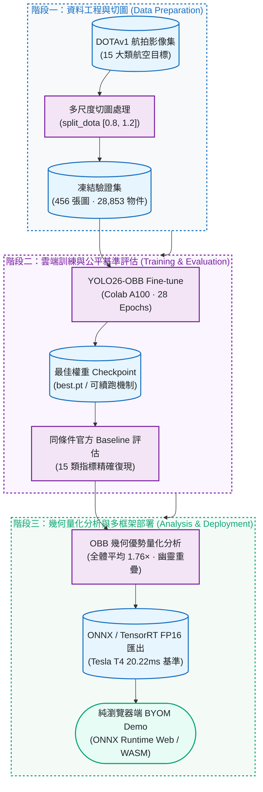

正體中文 | [English](README.en.md)

# Aerial OBB Lab

[](https://github.com/kuotunyu/aerial-obb-lab/actions/workflows/release-gates.yml)


這個專案把 **YOLO26-OBB on DOTAv1** 從 A100 Fine-tuning、matched baseline evaluation、
OBB／HBB geometry analysis，一路做到 ONNX／TensorRT benchmark 與 Browser BYOM demo。
結果不美化：fine-tuned model 在同條件下是持平略降。

**Demo：**[`demo/web/`](demo/web/) · **Model card：**[`docs/model_card.md`](docs/model_card.md) ·
**發布範圍：**程式碼、證據、三張 public-domain NAIP 航拍衍生圖，以及一個 privacy-sanitized AGPL demo model。

<!-- claim:browser-scope -->
> 瀏覽器 demo 首先顯示官方航拍原圖；使用者按「開始 Detect」後，才會載入 same-origin
> privacy-sanitized AGPL derivative 與 pinned runtime，在目前的 browser session 執行真正 inference。
> BYOM 仍可使用使用者自行提供的相容 ONNX 與圖片；所有 model／image bytes 都不會上傳。
> 這個 integration demo 與 screenshot **不代表** fine-tuned `yolo26m-obb` 的 accuracy、evaluation
> 或歷史 T4 latency evidence。
<!-- /claim:browser-scope -->

## 關鍵成果

| 面向 | 結果 | 證據邊界 |
|---|---|---|
| Matched evaluation | Fine-tuned 相較官方 baseline：Δ mAP50 **-0.05pt**、Δ mAP50-95 **-0.13pt** | 持平略降，不宣稱精度提升 |
| OBB geometry | 456 張 val images、28,853 個 objects；全體 weighted mean HBB／OBB 面積比 **1.76×**（bridge mean 2.43×） | Ground-truth geometry，不是 detector benchmark |
| Deployment | TensorRT FP16 **20.22 ms／49.4 FPS** | 歷史 Tesla T4、batch=1、1024px 指定環境 |
| Browser-native real-image demo | 選擇三張 public-domain NAIP 原圖之一 → 使用者按 Detect → 本機 genuine inference；另有進階 BYOM | Detect 才 lazy-load pinned jsDelivr runtime 與 same-origin privacy-sanitized derivative；非零網路、不含 DOTA pixels |


*選取的 public-domain NAIP 原圖經使用者按 Detect 後，在本機 browser 完成真正 inference 並顯示 rotated polygons、數值 runtime 與結果表；這些為視覺清楚而 curated 的 integration examples，不代表 accuracy、evaluation 或歷史 T4 latency；guardrails 僅用於 drift checks。*

---

## 專案流程



更細的訓練、評估、分析與部署分支收錄在下方各節。

---

## 執行進度

| 階段 (Phase) | 實作內容 | 執行環境 | 交付狀態 |
|---|---|---|---|
| Phase 0 | 專案骨架、依賴鎖定與開發環境設置 | 本機 CPU | 已完成 |
| Phase 1 | DOTA8 Smoke Test（Train ➔ Val ➔ Predict ➔ Resume ➔ ONNX） | 原開發電腦 | 已完成 |
| Phase 2 | DOTAv1 正式 Fine-tuning（28 Epochs Early-stop） | Google Colab A100 | 已完成 |
| Phase 3 | 同條件對照官方 Baseline 評估與 15 類指標復現 | Colab + 本機 | 已完成 |
| Phase 4 | 「為什麼需要 OBB」幾何膨脹率與幽靈重疊量化分析 | 本機 | 已完成 |
| Phase 5 | ONNX / TensorRT FP16 匯出與三框架 Latency Benchmark | Colab Tesla T4 | 已完成 |
| Phase 6 | 靜態 BYOM 純瀏覽器 Demo | 本機 / Web | 已完成 |
| Phase 7 | 完整技術文件、Model Card、發布稽核門禁 | 本機 CI | 已完成 |

---

## 評估：Fine-tuned vs 官方 Baseline

<!-- claim:matched-evaluation -->
- **Training：**Colab A100；重切 DOTAv1（`split_dota` `[0.8, 1.2]`）；
  `yolo26m-obb.pt` 跑 28/30 epochs，`patience=15` early stop。
- **Recovery：**2026-07-15 以 checksum／provenance gate 完成 validation-only 補值：
  `plane` 0.952147／0.862352、`ship` 0.909448／0.762681、`storage tank`
  0.850699／0.716696（mAP50／mAP50-95）。
- **Evidence：**[CSV](docs/per_class_metrics.csv) · [JSON](docs/per_class_metrics.json) ·
  [recovery notebook](notebooks/03_recover_per_class_metrics_colab.ipynb) ·
  [完整分析](docs/training_results.md)。

| 模型配置 | 評估資料劃分 (Split) | mAP50 | mAP50-95 |
|---|---|---:|---:|
| yolo26m-obb.pt（官方公布數字） | DOTAv1 test | 81.0 | 55.3 |
| yolo26m-obb.pt（官方權重，本專案實測） | DOTAv1 val（本專案切法） | 78.2 | 63.3 |
| fine-tuned `best.pt` | DOTAv1 val（本專案切法） | 78.2 | 63.1 |

**比較規則：**只有後兩列能直接比較；它們使用相同 val split、tiling 與 evaluation。第一列是
官方 test split 結果，只提供背景資訊。

**結論：**fine-tune 是**持平略降**（Δ mAP50 **-0.05pt**、Δ mAP50-95 **-0.13pt**），
不是精度提升。官方 checkpoint 已在 DOTAv1 訓練；這次量到的是繼續訓練已收斂模型的邊際效益。

**限制：**Baseline raw console log 未提交；四位小數與 rounded delta 為保留的歷史結果。
證據強度與限制可由 [`release/evidence.json`](release/evidence.json) 機器驗證。
<!-- /claim:matched-evaluation -->

---

## 為什麼需要旋轉框？（用數據說話）

<!-- claim:analysis -->
以 **DOTAv1 val 456 張圖、28,853 個 ground-truth objects**量測。全體 weighted mean
HBB／OBB 面積比為 **1.76×**；`bridge` mean 為 **2.43×**。
[完整表格](docs/analysis_results.md) · [重現腳本](scripts/obb_analysis.py)

**1. 水平框吞掉大量背景。** 「軸對齊外接框面積 ÷ 旋轉框面積」：

| 目標類別 | 平均膨脹倍數 | p90 膨脹倍數 | | 對照組（圓形目標） | 平均膨脹倍數 |
|---|---:|---:|---|---|---:|
| bridge | 2.43× | 3.71× | | roundabout | 1.02× |
| harbor | 2.15× | 3.66× | | storage tank | 1.00× |
| large vehicle | 2.14× | 3.21× | | | |
| ship | 1.95× | 2.69× | | | |

**解讀：**細長、旋轉目標約膨脹 2×；圓形對照組維持約 1.0×，差異來自方向性。

**2. 密集場景中，水平框的重疊多半是「幽靈重疊」。** 同類別相鄰物件中，
水平框 IoU ≥ 0.3 的配對裡，實際旋轉框 IoU < 0.1 的比例：

| 目標類別 | HBB IoU≥0.3 配對數 | 幽靈重疊率 |
|---|---:|---:|
| large vehicle | 810 | 100% |
| ship | 736 | 99% |
| harbor | 43 | 98% |
| small vehicle | 42 | 93% |

**限制：**這是 ground-truth geometry proxy，不是 detector／NMS 實驗。它顯示 HBB 可能高估
密集物件重疊與 suppression risk，沒有量測特定 detector 實際少掉多少 predictions。

**3. 視覺來源：**五張 DOTA 衍生比較圖不納入本 public release；僅保留可重現數據。
<!-- /claim:analysis -->

---

## 部署 Benchmark：PyTorch vs ONNX Runtime vs TensorRT FP16

<!-- claim:t4-benchmark -->
- **Hardware：**Colab Tesla T4。
- **Input：**batch=1、imgsz=1024。
- **Measurement：**每個 backend 20 warmup + 100 timed runs。
- **Artifact：**fine-tuned `best.pt` → ONNX／TensorRT FP16；engine 綁定 build 時的 GPU 與 TensorRT。
- **Notebook：**[02_benchmark_colab.ipynb](notebooks/02_benchmark_colab.ipynb)。

<!-- claim:export-smoke -->
**Export smoke：**DOTA8 val 上 PyTorch、ONNX、TensorRT 的 mAP50 都是 **0.9950**，符合
<1pt parity gate。這只驗證匯出一致性，**不是完整 DOTAv1 production certification**；raw log 未提交。
<!-- /claim:export-smoke -->

| 推論後端 (Backend) | 檔案大小 (MB) | 平均延遲 (Mean Latency) | 延遲中位數 (p50) | 95 分位延遲 (p95) | 輸送量 (FPS) |
|---|---:|---:|---:|---:|---:|
| PyTorch (FP32) | 48.7 | 71.54 ms | 71.49 ms | 74.08 ms | 14.0 |
| ONNX Runtime GPU | 85.3 | 79.09 ms | 79.67 ms | 81.43 ms | 12.6 |
| TensorRT FP16 | 45.0 | 20.22 ms | 20.14 ms | 21.09 ms | 49.4 |

**結果：**在這個限定比較內，TensorRT FP16 約快 3.5× 且檔案最小；ONNX Runtime GPU 則略慢於
PyTorch。ONNX 仍是 `demo/web/` 使用的 ONNX Runtime **Web** 模型交換格式。

**證據邊界：**這是指定 T4、batch=1、1024px 與當時 Colab／TensorRT 的**歷史結果**。
完整 runtime version strings 未保存；數字不代表其他硬體、Browser、throughput 或 production SLA。

**環境紀錄：**`torch._dynamo`、HF CDN 與 ONNX Runtime CUDA provider 問題見
[docs/DESIGN_NOTES.md](docs/DESIGN_NOTES.md)。
<!-- /claim:t4-benchmark -->

---

## 重現步驟

### 1. 本機開發（CPU-only，不需訓練或 GPU）

需求：Python 3.11、CPU。不要跨電腦複製 `.venv`。

```powershell
uv python install 3.11
uv venv --python 3.11
uv sync --frozen --no-install-project
.venv/Scripts/python.exe scripts/repo_check.py
.venv/Scripts/python.exe scripts/release_check.py
.venv/Scripts/python.exe -m pytest
.venv/Scripts/python.exe -m http.server 8765 --directory demo/web
```

- Demo：開啟 `http://localhost:8765`；先看官方航拍原圖，再按「開始 Detect」。影像與模型不會上傳；
  第一次 Detect 才會讀取 same-origin privacy-sanitized derivative，並由固定版本 CDN + SRI 載入 runtime。
- Default env：不含 Torch、CUDA、Ultralytics 或 Python ONNX Runtime。
- 壞掉的 `.venv`：執行 `uv venv --clear --python 3.11`；Linux/macOS 改用 `.venv/bin/python`。
- Windows 非 ASCII path：使用 `--no-install-project` 並直接呼叫 Python；細節見
  [DESIGN_NOTES T6](docs/DESIGN_NOTES.md)。
- `tool.uv.link-mode = "copy"`：避免環境與 uv cache 互相污染。

Clean-export gate 會在乾淨 HEAD 重建環境，檢查 tests／links／privacy／artifacts／browser，
再 build 並安裝 wheel。Browser smoke 會在 Chromium 中執行真實範例 inference 與 BYOM 安全路徑：

```powershell
.venv/Scripts/playwright.exe install chromium
.venv/Scripts/python.exe scripts/clean_export_check.py
```

### 2. 歷史 Colab 工作流（不屬於本 release gate）

這三份 notebook 只保留 provenance；**發布、檢查或展示本 RC 都不需要執行**。前兩份會使用 GPU、
DOTA 與 private Hugging Face remote writes；只有在獨立重現且完成授權／逐格審閱後才執行。
結果已凍結，不為改善數字而重跑。

- [01_train_dotav1_a100.ipynb](notebooks/01_train_dotav1_a100.ipynb)：原始 A100 fine-tuning、private
  checkpoint 備援與斷線續跑流程。
- [02_benchmark_colab.ipynb](notebooks/02_benchmark_colab.ipynb)：原始 T4 ONNX／TensorRT FP16 export、
  parity 與三 backend benchmark 流程。
- [03_recover_per_class_metrics_colab.ipynb](notebooks/03_recover_per_class_metrics_colab.ipynb)：使用 owner
  自行提供且 checksum 相符的 checkpoint，validation-only 補回三類指標；不下載模型、不重新訓練。

**Accepted evidence：**[evidence.json](release/evidence.json) ·
[per_class_metrics.json](docs/per_class_metrics.json) · [training_results](docs/training_results.md)

### 3. 瀏覽器真實影像 Demo + BYOM

- 共同 viewport 提供小型機場（預設）、運動場館、港區三個 public-domain NAIP 原圖選項；按「開始 Detect」才會 lazy-load pinned
  ONNX Runtime Web 與 same-origin privacy-sanitized YOLO26n-OBB derivative，在目前的 browser session
  完成真正 inference，然後在同一位置顯示 rotated polygons、數值 runtime、provenance 與結果表格。
- 「查看原圖／查看結果」以及 confidence／class filters 都只重繪同一份 cached output，不會重新 inference。
  BYOM 是預設收合的進階入口，user-supplied model／image bytes 同樣只在 Browser 內處理且不會上傳。
- 第一次 Detect 或 cache miss 會向 jsDelivr 請求 pinned JavaScript 與 WASM assets，所以不是 zero-network。
  SHA-384 SRI 只驗證 `ort.min.js`；runtime 後續取得的 WASM assets 不在該 script SRI 的涵蓋範圍。
- Asset、runtime、integrity、model contract、inference、output、render 或 image decode 失敗時，UI 會清除
  stale 結果，保留安全的原圖／重試路徑，並只顯示固定且不洩漏 local filename 的錯誤。無效的新 BYOM
  model 不會取代最後一個已驗證 session。

---

## 授權與聲明

- Repository code：依 `pyproject.toml` 宣告為 **AGPL-3.0-or-later**；Ultralytics components
  仍受 Ultralytics 各自的 AGPL／Enterprise 授權路線約束。
- 本 candidate 包含一個已移除私人 build metadata、graph／weights 不變的 YOLO26n-OBB AGPL derivative，
  以及三張 public-domain NAIP 航拍衍生圖；不含 DOTA pixels、標註或衍生 render。模型的 DOTAv1 training provenance
  已揭露，本專案不暗示 Ultralytics endorsement，也不主張取得商用許可。使用者自行提供的模型與影像
  仍受其資料集、上游軟體、權重及 image-rights 條款約束。
- Artifact hash、第三方條款與 release gates：見 [artifact manifest](release/artifact-manifest.json)、
  [third-party notices](THIRD_PARTY_NOTICES.md) 與 [release checklist](RELEASE_CHECKLIST.md)。

*English version: [README.en.md](README.en.md)*
