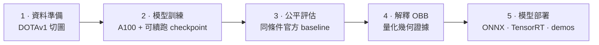

# YOLO26 OBB × DOTA：航拍旋轉框偵測，從訓練到部署

> ✅ 已完成（Phase 0–7）— 完整計畫見 [docs/PLAN.md](docs/PLAN.md)。

以 **YOLO26-OBB**（旋轉框）在 **DOTAv1** 航拍資料集上 fine-tune，展示完整生命週期：
Colab A100 訓練 → 與官方 baseline 對照評估 → 用數據回答「為什麼航拍場景需要 OBB」→ ONNX / TensorRT FP16 匯出與三框架 latency benchmark → Gradio demo + Hugging Face Space。

**🚀 線上 demo（100% 瀏覽器端運算，無伺服器）：https://huggingface.co/spaces/steven0226/yolo26-obb-aerial-detection**
**Model card：https://huggingface.co/steven0226/yolo26m-obb-dota**

> 線上 Space 為了能免費在瀏覽器內執行，刻意使用輕量的官方 `yolo26n-obb` ONNX 模型；本專案
> 評估與 benchmark 的 fine-tuned `yolo26m-obb` 成果放在上方 model repo，並供選配的本機 demo 使用。

## 專案流程



更細的訓練、評估、分析與部署分支收錄在下方各節。公開瀏覽器
demo 是刻意分開的輕量部署路線，不能代表 fine-tuned medium checkpoint 的實測準確度或 T4 latency。

## 進度

| Phase | 內容 | 位置 | 狀態 |
|---|---|---|---|
| 0 | 環境與骨架 | 本機 | ✅ |
| 1 | DOTA8 smoke test | 原開發電腦 | ✅ |
| 2 | DOTAv1 正式 fine-tune | Colab A100 | ✅ |
| 3 | 對照官方 baseline 評估 | Colab + 本機 | ✅ |
| 4 | 「為什麼需要 OBB」量化分析 | 本機 | ✅ |
| 5 | ONNX / TensorRT 匯出與 benchmark | Colab GPU | ✅ |
| 6 | 本機 Gradio 參考版 + 瀏覽器 static HF Space | 本機 + HF | ✅ |
| 7 | 文件、model card、收尾 | — | ✅ |

## 評估：Fine-tuned vs 官方 Baseline

在 Colab A100 上用重新切過的 DOTAv1（`split_dota` 尺度 `[0.8, 1.2]`）fine-tune
`yolo26m-obb.pt`，跑了 28/30 個 epoch、由 `patience=15` 觸發提早停止。2026-07-15 已完成有
checksum 與來源證據閘門的 validation-only 補值，補回原 session 未保存的三類：`plane`
0.952147 / 0.862352、`ship` 0.909448 / 0.762681、`storage tank` 0.850699 / 0.716696
（mAP50 / mAP50-95）。完整 15 類結果可查閱 [CSV](docs/per_class_metrics.csv) 與
[JSON](docs/per_class_metrics.json)，重現流程在
[notebooks/03_recover_per_class_metrics_colab.ipynb](notebooks/03_recover_per_class_metrics_colab.ipynb)。
逐類別對照、補值審核、訓練曲線分析與混淆矩陣發現見
[docs/training_results.md](docs/training_results.md)。

| 模型 | split | mAP50 | mAP50-95 |
|---|---|---:|---:|
| yolo26m-obb.pt（官方公布數字） | DOTAv1 test | 81.0 | 55.3 |
| yolo26m-obb.pt（官方權重，本專案實測） | DOTAv1 val（本專案切法） | 78.2 | 63.3 |
| fine-tuned `best.pt` | DOTAv1 val（本專案切法） | 78.2 | 63.1 |

**只有下面兩行可以直接比較**——同一個 val split、同樣的切圖方式、同一套驗證流程、同條件。
第一行是官方在 test split 上、用 DOTA 官方評測工具算出的數字，放在這裡僅供參考，不是拿來
比較用的（test/val 這個落差在 mAP50 跟 mAP50-95 上方向不一致，原因見
[docs/training_results.md](docs/training_results.md)）。

在同條件下比較，fine-tune 幾乎沒有帶來進步（Δ mAP50 -0.05 個百分點、Δ mAP50-95 -0.13 個
百分點）。這是預期中的結果，不是訓練失敗：`yolo26m-obb.pt` 本來就是官方在 DOTAv1 上訓練過
的權重，這次等於是「繼續訓練一個已經收斂的模型」而不是「帶模型認識新領域」，這個結果量化
的正是這種情境下的邊際效益上限，不是要展示一次大幅進步。

## 為什麼需要旋轉框？（用數據說話）

在 **DOTAv1 驗證集 456 張圖、28,853 個標註物件**上實測（完整表格見
[docs/analysis_results.md](docs/analysis_results.md)，重現腳本
[scripts/obb_analysis.py](scripts/obb_analysis.py)）：

**1. 水平框吞掉大量背景。** 「軸對齊外接框面積 ÷ 旋轉框面積」：

| 類別 | 平均 | p90 | | 對照組（圓形） | 平均 |
|---|---:|---:|---|---|---:|
| bridge | **2.43×** | 3.71× | | roundabout | 1.02× |
| harbor | **2.15×** | 3.66× | | storage tank | 1.00× |
| large vehicle | **2.14×** | 3.21× | | | |
| ship | **1.95×** | 2.69× | | | |

細長且任意旋轉的目標會讓水平框膨脹約 2 倍；而圓形類別（儲油槽、圓環）維持 1.0×，
證明這個量測反映的是「方向性」而非標註雜訊。

**2. 密集場景中，水平框的重疊多半是「幽靈重疊」。** 同類別相鄰物件中，
水平框 IoU ≥ 0.3 的配對裡，實際旋轉框 IoU < 0.1 的比例：

| 類別 | HBB IoU≥0.3 配對數 | 幽靈重疊率 |
|---|---:|---:|
| large vehicle | 810 | **100%** |
| ship | 736 | **99%** |
| harbor | 43 | **98%** |
| small vehicle | 42 | **93%** |

水平框偵測器的 NMS 會把這些視為重複偵測而誤殺 —— 停車場的卡車、
港口並排的船就這樣消失。旋轉框讓重疊度（與 NMS 的決策）回歸真實。

**3. 一圖勝千言** —— 同一個碼頭、同一份標註（5 組對照圖都在 `assets/`）：


## 部署 Benchmark：PyTorch vs ONNX Runtime vs TensorRT FP16

在 Colab **Tesla T4** 上把 fine-tuned `best.pt` 匯出成 ONNX 跟 TensorRT FP16 engine
（[notebooks/02_benchmark_colab.ipynb](notebooks/02_benchmark_colab.ipynb)，可獨立重現）。匯出
與 benchmark 固定在 Colab 執行，不綁定貢獻者自己的 GPU 或 Windows TensorRT 環境。batch=1、imgsz=1024，每個後端
20 次 warmup + 100 次計時取平均，engine 綁定這次 build 用的 GPU 型號與 TensorRT 版本。

**先做匯出精度驗證**（dota8 val，同工具同條件比較三個後端）：PyTorch mAP50=0.9950、
ONNX 0.9950、TensorRT 0.9950——三者沒有精度損失，符合這個專案一開始設的 <1 個百分點門檻
（YOLO26 的 end-to-end 匯出有已知 issue，ultralytics#23397 等）。

| 後端 | 檔案大小 (MB) | 平均延遲 | p50 | p95 | FPS |
|---|---:|---:|---:|---:|---:|
| PyTorch (FP32) | 48.7 | 71.54 ms | 71.49 ms | 74.08 ms | 14.0 |
| ONNX Runtime GPU | 85.3 | 79.09 ms | 79.67 ms | 81.43 ms | 12.6 |
| TensorRT FP16 | 45.0 | 20.22 ms | 20.14 ms | 21.09 ms | 49.4 |

**TensorRT FP16 比原生 PyTorch 快約 3.5 倍**，檔案也最小。**ONNX Runtime GPU 反而比原生
PyTorch 略慢**——沒有 TensorRT 這種圖編譯後端加持的話，ONNX Runtime 的 GPU 執行不一定會贏
PyTorch 自己的 cuDNN kernel。會保留這個後端是因為 ONNX 匯出是下面兩種部署路線共同的起點
（`demo/space/` 的伺服器端 ONNX Runtime CPU、以及實際部署的 `demo/space-static/` 用瀏覽器端
ONNX Runtime **Web**）——不是因為 GPU 版 ONNX Runtime 本身是最快的選項。

拿到這組數字的過程踩了好幾輪 Colab 環境的坑，都不是這個專案自己程式碼的問題：`torch._dynamo`
內部版本兜不起來、HF 檔案 CDN 間歇性回傳簽章失效的下載連結、ONNX Runtime 的 CUDA 執行
provider 會讓整個 Colab 執行階段原生崩潰（後來改用獨立子行程隔離跑推論解決）。完整過程寫在
[docs/DESIGN_NOTES.md](docs/DESIGN_NOTES.md)。

## 重現步驟

**本機開發（CPU-only，不需訓練或模型推論）**

專案以 `.python-version` 固定 Python 3.11。虛擬環境只屬於建立它的那台電腦，請勿從其他電腦
複製 `.venv`。

```powershell
uv python install 3.11
uv venv --python 3.11
uv sync --locked --no-install-project
.venv/Scripts/python.exe scripts/repo_check.py
.venv/Scripts/python.exe -m pytest
.venv/Scripts/python.exe -m http.server 8765 --directory demo/space-static
```

開啟 `http://localhost:8765` 即可使用純瀏覽器 demo。預設安裝只含分析與開發工具，刻意不安裝
Torch、CUDA、Ultralytics、ONNX Runtime 或 Gradio；`tool.uv.link-mode = "copy"` 也會避免環境
與 uv 套件快取彼此污染。
如果 `.venv` 是從其他電腦複製過來或用了錯誤直譯器，請先用
`uv venv --clear --python 3.11` 重建一次。Linux/macOS 請把上方 Windows 路徑改成
`.venv/bin/python`。

`--no-install-project` 會避開 editable-install 的 `.pth` 指標檔；Windows checkout 路徑含非 ASCII
字元時，該檔可能讓 CPython 啟動失敗（細節見 [docs/DESIGN_NOTES.md](docs/DESIGN_NOTES.md) T6）。
基於同一原因，請直接呼叫 `.venv/Scripts/python.exe`，不要用 `uv run`。

**選配：本機 ML／Gradio**

```powershell
uv sync --locked --no-install-project --group demo
# HF_MODEL_REPO 可省略；未設定時會依序使用本機 best.pt、官方權重
.venv/Scripts/python.exe demo/app.py
```

此群組只為方便本機展示，並刻意使用 CPU-only PyTorch wheel。GPU 訓練、完整評估、匯出與
benchmark 仍固定使用 Colab；若真的要使用本機 GPU 推論，請另建符合自己 GPU 的 PyTorch
環境。只有 Hub 上傳／下載需要
`HF_TOKEN`，預設檢查與 static demo 都不需要。

**Colab（訓練 + 評估補值 + benchmark）**——三份 notebook 都是自包含的，不需要 clone
這個 repo：
1. 上傳 [notebooks/01_train_dotav1_a100.ipynb](notebooks/01_train_dotav1_a100.ipynb) →
   執行階段 → A100 GPU → 左側 🔑 Secrets 加 `HF_TOKEN`（write 權限）→ 全部執行。會自動下載
   DOTAv1、切圖、fine-tune，訓練過程中持續把 checkpoint push 到你的 HF model repo（斷線也
   不怕，重新打開同一份 notebook 再執行會自動接續）
2. 上傳 [notebooks/02_benchmark_colab.ipynb](notebooks/02_benchmark_colab.ipynb) → T4 GPU
   → 同一個 `HF_TOKEN` secret → 全部執行。會匯出 ONNX + TensorRT FP16、驗證匯出精度、
   benchmark 三種後端
3. 若要免重訓重現並驗證已補回的三類指標，上傳
   [notebooks/03_recover_per_class_metrics_colab.ipynb](notebooks/03_recover_per_class_metrics_colab.ipynb)
   → Colab GPU（建議 A100）→ 全部執行，不需要 token。它會核對固定 revision 的公開權重，
   核對 DOTAv1 ZIP 的完整 SHA-256，再依原參數重切並記錄 val manifest；若權重自動下載失敗，
   可從[固定 model revision](https://huggingface.co/steven0226/yolo26m-obb-dota/blob/3f5705719a6e161fd105118fa8ba80b9a6cb1536/best.pt)
   下載後上傳成 `/content/best.pt`。專案擁有者也可使用未納入 Git 的本機
   `runs/yolo26m-obb-dotav1/weights/best.pt`。它會匯出完整 15 類 CSV/JSON，並用歷史 aggregate
   與原先保存的 12 類驗證補值。通過審核的結果已記錄在
   [docs/training_results.md](docs/training_results.md)；除非要獨立重現證據，否則不需要再跑一次
4. 把每份 notebook 最後印出的 `=== PASTE BACK ===` 區塊複製下來記錄

**HF Space（線上 demo）**：把 `demo/space-static/` 資料夾內容推到一個新的 **static** SDK
Space（兩個資料夾裡的 `README.md` 都已經是 Space 需要的設定檔頭）。實際部署的是這個版本，
原因見下方。`demo/space/`（Gradio SDK、伺服器端 ONNX Runtime CPU）保留在 repo 裡當作本機驗證
過能跑的參考實作，但沒有真的部署成 Space。

**為什麼會有兩份實作**：本專案部署當時（2026-07-15），HF API 回應顯示 `cpu-basic` 上的
Gradio/Docker Space 需要 PRO 訂閱（`Static Spaces are free for everyone, but hosting Gradio
and Docker Spaces on free cpu-basic requires a PRO subscription`）。在這個限制下，不需付費後端的
公開 demo 路線是 **static** Space +
瀏覽器端推論。`demo/space-static/` 把同一套偵測流程用純 JavaScript +
[ONNX Runtime Web](https://onnxruntime.ai/docs/tutorials/web/)（WASM）重新實作一遍——模型
只下載一次（~10MB），之後每次推論都在訪客的瀏覽器裡跑完，完全不經過任何伺服器。開始寫
JS 之前，先把輸入輸出格式（letterbox 前處理、`[N,7]` 輸出解碼）拿 Python 端結果反推驗證過，
完整過程見 [docs/DESIGN_NOTES.md](docs/DESIGN_NOTES.md)。

## 授權

- 程式碼：**AGPL-3.0**（[Ultralytics](https://github.com/ultralytics/ultralytics) 為 AGPL-3.0，fine-tune 權重屬衍生物、同授權）
- 資料集：**DOTA 限學術用途，禁止商業使用**

*（English version: README.md）*
